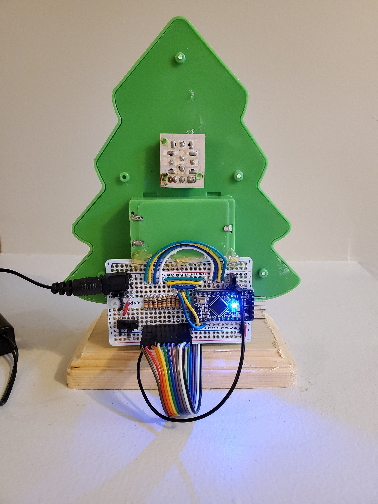

# tree-o-light

This tree was boring.

It had a light switch to turn all of the lights on or off. That was it. And the LEDs were so bright that I thought someone was welding. 

It was heading to the trash bin but I grabbed it and got into the holiday spirit. 

Click on the image below for a demo:

# License

MIT
